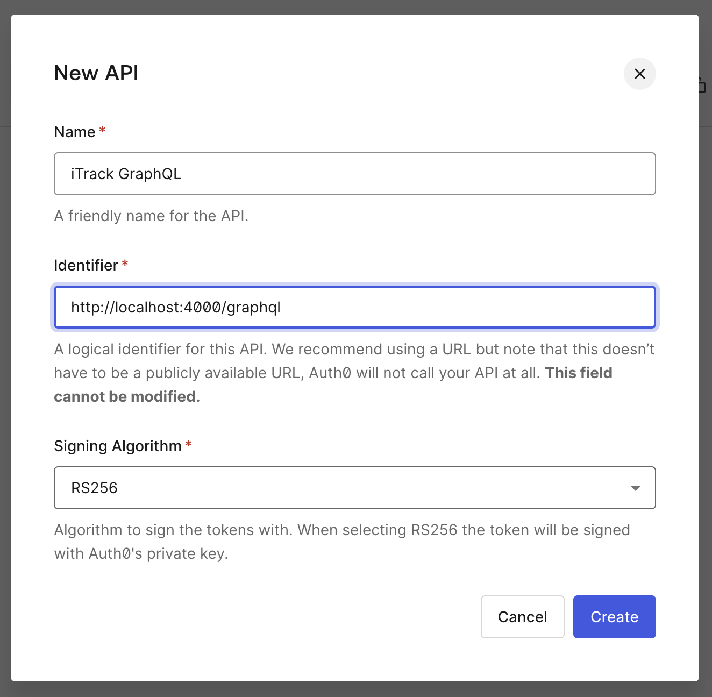
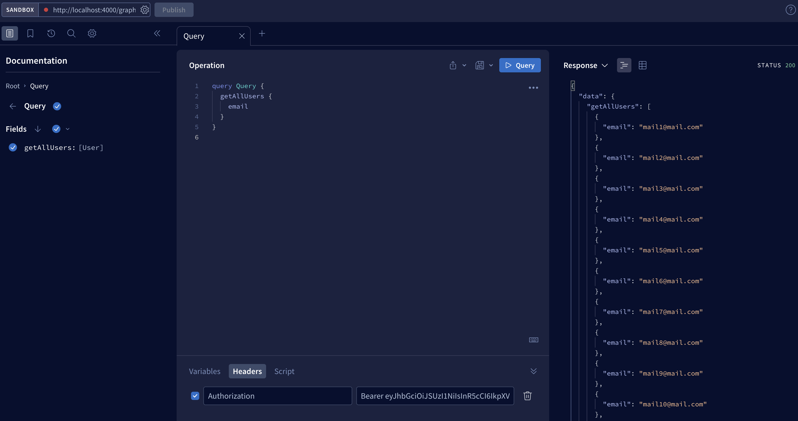
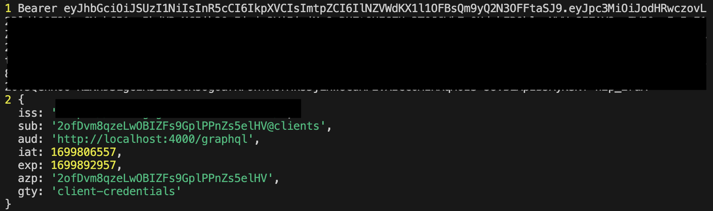

Previously I talked about setting up an Apollo server with ExpressJs for GraphQL APIs, but these APIs aren't protected. Ideally I want my APIs to be protected by something like an Authorization header.

I decided to go with [Auth0](https://auth0.com/docs/) as this seems like the industry standard for authentication, plus it is a method that I haven't tried before, so plenty of opportunity for learning.

First, I followed [this tutorial](https://auth0.com/docs/quickstart/backend/nodejs/interactive) and created an API on the Auth0 dashboard like so:



Then, using the `express-oauth2-jwt-bearer` package mentioned in the tutorial, I created the middleware that checks for the JWT token in the Authorization header:

```
// src/index.ts
const checkJwt = auth({
    audience: process.env.AUTH0_API_AUDIENCE,
    issuerBaseURL: process.env.AUTH0_DOMAIN
})
```

Now I just need to add this middleware to my GraphQL routes, which took me awhile to find the resources I need for this, but eventually I found [this](https://www.apollographql.com/docs/apollo-server/api/express-middleware/).

Using this method of `expressMiddleware` allows me to add the `checkJwt` middleware like so:

```
// src/index.ts
app.use(
    '/graphql',
    cors(),
    express.json(),
    checkJwt,
    expressMiddleware(server, {
        context: async ({ req }) => {
            // add context here
        }
    })
)
```

**Very important note:** Do remember that to use `expressMiddleware`, the `cors()` and `express.json()` are **required**.

I skimmed over this information in the docs and spent a good few hours trying to figure out why my Apollo server wasn't starting. Lesson learned: do not skim.

What if I need something that is encoded in the JWT token claims?

I followed [this tutorial](https://www.apollographql.com/docs/apollo-server/security/authentication/) and modified the `context` to the following:

```
// src/index.ts
app.use(
    '/graphql',
    cors(),
    express.json(),
    checkJwt,
    expressMiddleware(server, {
        context: async ({ req }) => {
            const token = req.headers.authorization || ''
            console.log(1, token)

            console.log(2, req.auth?.payload)

            return { user: { email: 'test@mail.com' } }
        }
    })
)
```

Since I haven't added anything to the claims yet, I will just use some loggers and return a static email to the context for now.

Now for testing, first I went to my Auth0 API dashboard and got a test token from the "Test" tab.

Then I launched my server via `npm run dev`, and used the [Apollo Sandbox](https://studio.apollographql.com/sandbox/explorer) to test my GraphQL APIs:



It works! Checking my terminal showed that the token was also decoded successfully:



So now that everything works so far, my next step is to actually implement the authentication part in my [NextJs client](https://github.com/fattynomnom/itrack-nextjs).

I've committed all my progress so far to [this repo](https://github.com/fattynomnom/itrack-expressjs).

**You can check the list of resources I've referenced here:**

-   [Add authorization to an Express.js API application](https://auth0.com/docs/quickstart/backend/nodejs/interactive)
-   [expressMiddleware API docs](https://www.apollographql.com/docs/apollo-server/api/express-middleware/)
-   [Authentication and authorization](https://www.apollographql.com/docs/apollo-server/security/authentication/)
