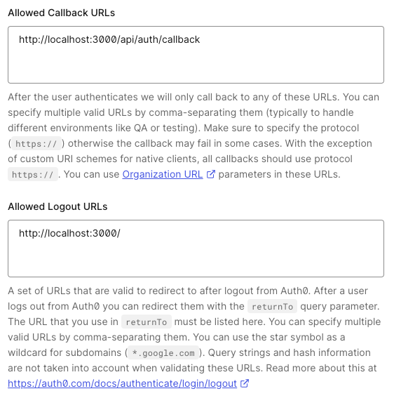
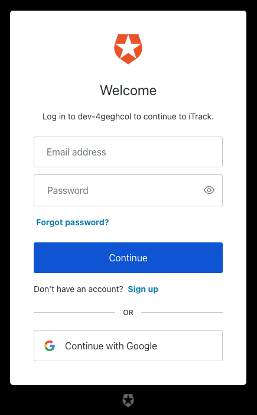

Initially I had implemented Firebase authentication for my [NextJs project](https://github.com/fattynomnom/itrack-nextjs), but if you saw my previous update, I decided to go ahead with Auth0 instead.

For this, I'll be using the [nextjs-auth0 package](https://github.com/auth0/nextjs-auth0#page-router).

# Configure Auth0 application

First, I followed [the docs](https://github.com/auth0/nextjs-auth0#auth0-configuration) and updated my application's Allowed Callback URLs and Allowed Logout URLs in the Auth0 dashboard.



Something that I was REALLY confused about this step was the Allowed Callback URLs. I thought that I had to enter the URL that I wanted Auth0 to redirect to after login was completed. But it wasn't the case, I tried it and got an error after logging in. I'll explain how to ACTUALLY perform the redirect later.

# Configure package in NextJs

I updated the env variables required for the package to work:

```
// .env
# use `openssl rand -hex 32` command to generate a random secret
AUTH0_SECRET=
AUTH0_BASE_URL=http://localhost:3000
AUTH0_ISSUER_BASE_URL=
AUTH0_CLIENT_ID=
AUTH0_CLIENT_SECRET=
```

You can find these values in your Auth0 application dashboard.

The package will automatically detect these variables in your `.env` file, you don't have to actually import them anywhere unless you want to explicitly do so and customize your config. So make sure NOT to prepend `NEXT_PUBLIC_` to the env.

# Setup Auth0 APIs

Next, depending on what kind of NextJs router you're using, the setup for Auth0 APIs is different. Since my NextJs project is using `pages` directory instead of `app`, I followed [these steps](https://github.com/auth0/nextjs-auth0#page-router) to implement the auth pages.

```
// pages/api/auth/[auth0].ts
import { handleAuth, handleLogin } from '@auth0/nextjs-auth0'

export default handleAuth()
```

The package will setup the following APIs for you:

-   `/api/auth/login`
-   `/api/auth/callback`
-   `/api/auth/logout`
-   `/api/auth/me`

# Route to Auth0 APIs

Now directing user to login/signup is as easy as doing `<a href="/api/auth/login">Login</a>`, and the same applies for logout.

However, since these are APIs and not actual pages, you should not use `<Link>` but instead use `<a>`.

Now when the user clicks on "Login", they would see something like this:



This makes my `/login` and `/register` pages redundant now... If I'm not mistaken, you can still use custom login and registration pages, but maybe this is something I can explore a bit later, for now I just want to setup the authentication flow.

# Redirect user after login

Once user has logged in, by default, users will be redirected back to the root path `/`. I want to change this to direct users back to `/dashboard` instead, so I had to update `/pages/api/auth/[auth0].ts` to the following:

```
// pages/api/auth/[auth0].ts
import { handleAuth, handleLogin } from '@auth0/nextjs-auth0'

export default handleAuth({
    login: (req, res) => {
        handleLogin(req, res, {
            returnTo: '/dashboard'
        })
    }
})
```

If I correctly understand the documentation, you can also try using `<a href="/api/auth/login?returnTo=/dashboard">Login</a>` instead of updating the config, but I have not tested this.

# Get logged in user details

To get the logged in user details, you will need to implement the `UserProvider` in `_app.tsx`:

```
// pages/_app.tsx
import { UserProvider } from '@auth0/nextjs-auth0/client'

export default function MyApp({ Component, pageProps }) {
    <UserProvider>
        <Component {...pageProps} />
    </UserProvider>
}
```

Then you can simply use the `useUser` hook like so:

```
import { useUser } from '@auth0/nextjs-auth0/client'

export default function Settings() {
    const { user, error, isLoading } = useUser()

    return (
        <div className="grid grid-cols-12 px-7 py-10 max-w-3xl mx-auto">
            <Text className="col-span-4 my-auto">Email</Text>
            <TextInput
                className="col-span-8"
                disabled
                value={isLoading ? '' : user.email}
            />
        </div>
    )
}
```

Just make sure to properly handle the `isLoading` state, otherwise if you use `user.email` directly without waiting for it to load, you would receive a `Cannot access email of undefined` error.

# Protect authenticated routes with middleware

The package provides a `withMiddlewareAuthRequired` middleware that you can wrap each of your individual components in (see [here](https://github.com/auth0/nextjs-auth0/blob/main/EXAMPLES.md#protecting-a-server-side-rendered-ssr-page)).

For my use case, by default, all pages should be protected except these pages:

-   `/`
-   `/login`
-   `/register`

(I know my `/login` and `/register` pages are redundant, but I'm keeping them around for now because... I spent time on them!! And I might still want to use them later!!)

So instead of wrapping each of my components/pages with this middleware, I opted to do this instead:

```
// middleware.ts
import { withMiddlewareAuthRequired } from '@auth0/nextjs-auth0/edge'

export default withMiddlewareAuthRequired()

export const config = {
    // `/((?!login|register).*)` means to exclude pages starting with `/login` or `/register`
    // `(.+)` means to exclude specifically the root page `/`
    // Disclaimer: I'm not a regex wizard, this is just what I've googled
    matcher: '/((?!login|register).*)(.+)'
}
```

So now by default, all my pages (except the specified pages) will be protected by this middleware. See more on [NextJs middleware](https://nextjs.org/docs/pages/building-your-application/routing/middleware#matching-paths).

If I try to navigate to `/dashboard` without logging in first, the middleware would redirect me to login instead.

# Calling Auth0 protected external APIs

In my previous post, I had already setup my backend APIs to be protected by Auth0. So now I'll try calling those APIs from my app.

```
// .env
AUTH0_AUDIENCE=http://localhost:4000/graphql
```

```
// pages/api/users.ts
import { getAccessToken, withApiAuthRequired } from '@auth0/nextjs-auth0'
import axios from 'axios'

const users = async (req, res) => {
    const { accessToken } = await getAccessToken(req, res)
    const response = await axios.post(
        'http://localhost:4000/graphql',
        {
            query: `
                query Query {
                    getAllUsers {
                        email
                    }
                }
            `
        },
        {
            headers: {
                Authorization: `Bearer ${accessToken}`
            }
        }
    )
    res.status(200).json(response.data)
}

export default withApiAuthRequired(users)
```

```
// pages/dashboard.tsx
useEffect(() => {
    const getUsers = async () => {
        const response = await axios.get('/api/users')
        console.log(response)
    }
    getUsers()
}, [])
```

And it worked! I got a 200 status code and the data from my backend API.

Also a note (because I was confused about this too), I've tested and the `getAccessToken` method will fetch the existing access token, or if the access token is expired, refresh and fetch the new access token for you.

# Conclusion

Overall this setup was quite easy, I don't have to handle the authenticated state or credentials, and I don't have to worry about security, so I can see why more and more companies are adopting Auth0 as the standard, as opposed to setting up authentication themselves.

My next steps are to try to encode the logged in user's data (like email) into the token's claims, so that my backend APIs can decode the token and return data based on the token's claims.

To be honest, with my method of setting up authentication, I'm not sure if this is possible. I tried googling ahead before I implemented this whole authentication flow but I wound up even more confused, so I decided to implement the flow first and think about how to do this later.

**As usual, all resources:**

-   [nextjs-auth0 repo](https://github.com/auth0/nextjs-auth0#page-router)
-   [nextjs-auth0 examples](https://github.com/auth0/nextjs-auth0/blob/main/EXAMPLES.md#protecting-a-server-side-rendered-ssr-page)
-   [NextJs middleware](https://nextjs.org/docs/pages/building-your-application/routing/middleware)
