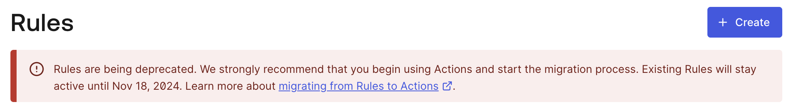
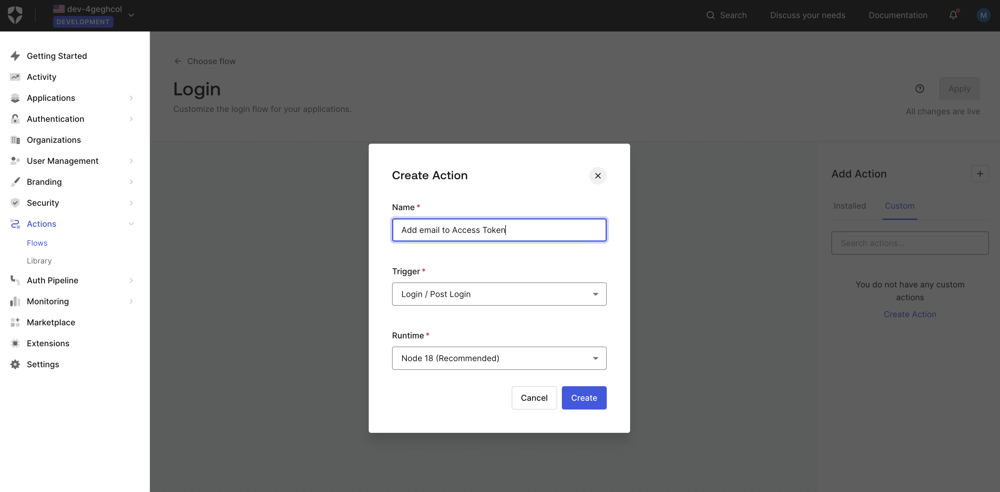
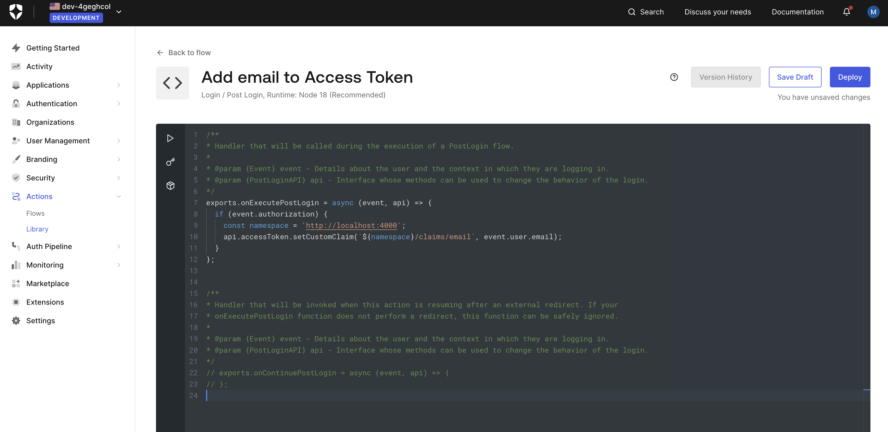
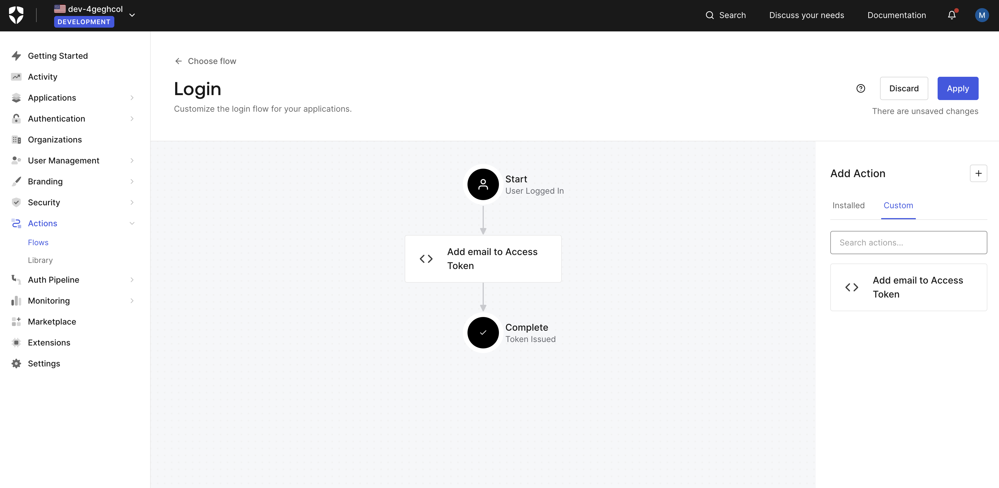
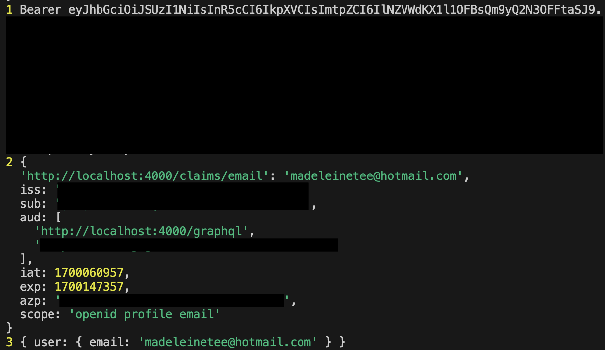

So I managed to find [this documentation](https://auth0.com/docs/get-started/architecture-scenarios/spa-api/api-implementation-nodejs#4-determine-the-user-identity) on how to add the user's details to your token's claims.

Just one problem, the documentation is outdated. It mentions using Rules, but when I went to the rules page, this is what I got:



Well, no point learning something that is going to be deprecated right.

So I did a bit more digging and came across [this thread](https://community.auth0.com/t/post-login-action-not-adding-email-to-access-token/97804). I don't exactly have this problem, but it pointed me in the right direction.

First, login to the Auth0 dashboard, and go to "Actions" > "Flows". Select the "Login" flow.

When you're in the Login flow, create an action like this:



Once the Action has been created, add the following code:

```
exports.onExecutePostLogin = async (event, api) => {
    if (event.authorization) {
        const namespace = 'http://localhost:4000';
        api.accessToken.setCustomClaim(`${namespace}/claims/email`, event.user.email);
    }
};
```

According to the docs and the community issue opened above, the reason why we are using `namespace` is to avoid conflict with existing claims, so make sure to use something unique.



Click on "Deploy", then go back to the Login flow.

On the right hand side, you should see your newly created "Add email to Access Token" action. Drag and drop this action to your flow like this:



Click on "Apply" and thats it, from now on when a user logs in, their email will be automatically added to the token's claims.

But I still need to test this by updating my backend project. First, I added the namespace I used earlier to my `.env` file:

```
// .env
AUTH0_EMAIL_CLAIM=http://localhost:4000/claims/email
```

Then replaced the static email used in my `expressMiddleware` context:

```
// src/index.ts
app.use(
    '/graphql',
    cors(),
    express.json(),
    checkJwt,
    expressMiddleware(server, {
        context: async ({ req }) => {
            const token = req.headers.authorization || ''
            console.log(1, token)

            console.log(2, req.auth?.payload)
            const email =
                req.auth?.payload[process.env.AUTH0_EMAIL_CLAIM || '']

            return {
                user: { email: email ? (email as string) : undefined }
            }
        }
    })
)
```

Lastly, adding loggers to my GraphQL resolvers for testing:

```
// src/Resolvers.ts
const Resolvers: Resolvers = {
    Query: {
        getAllUsers: async (
            _parent: unknown,
            _args: unknown,
            context: ApolloContext
        ) => {
            console.log(3, context)
            ...
        }
    },
    Mutation: {
        ...
    }
}
```

After this is done on the backend, I logged into my frontend application and queried `getAllUsers`. On top of the 200 status code and the data response, I checked my backend terminal to find this logged:



So it worked!

I'm aware that I'm not actually doing anything with the user's email yet, but now that I have the base setup, I can actually start setting up the tables and models I need for the frontend to use, so that's what I'll actually be doing next.

I'm not too sure if I'll be updating this space since I've actually gotten everything setup, and now its just the tedious task of setting up tables, schema and data, but I'll keep in mind to update whenever I learn something new.

I've committed my progress to [this repo](https://github.com/fattynomnom/itrack-expressjs).
