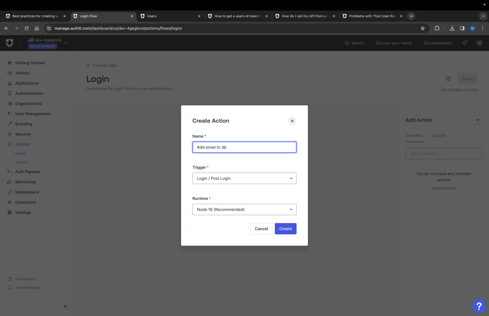
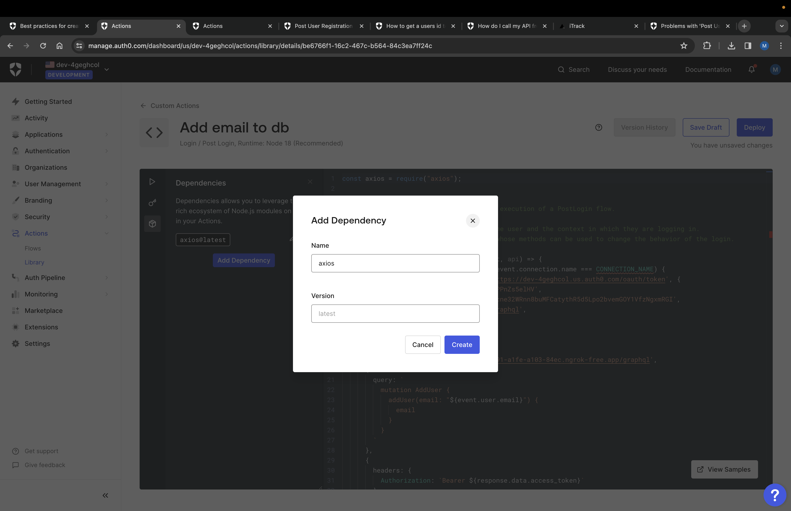
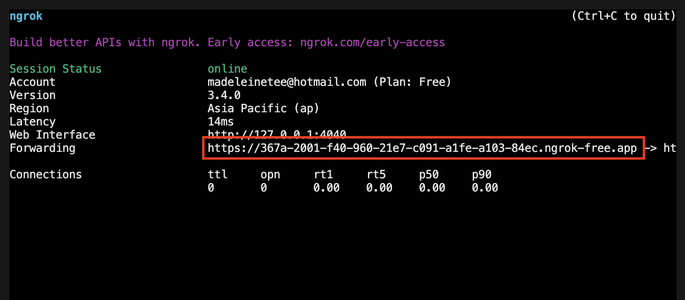

So I _thought_ I got my bases all covered but I forgot one thing... When a user registers with Auth0, the user is not being added to my PostgreSQL db, but into Auth0's db instead.

Considering they are two separate databases, doing relational queries like "Fetch transactions belonging to specific user", is harder to do.

So initially I had followed [this tutorial](https://auth0.com/docs/customize/actions/flows-and-triggers/post-user-registration-flow#store-the-auth0-user-id-in-a-remote-system) to add the registered user to my db after user has completed registration flow.

The tutorials mentions to add an action to the Post Registration flow, something like this:

```
exports.onExecutePostUserRegistration = async (event) => {
    await axios.post("https://my-api.exampleco.com/users", { params: { email: event.user.email }});
};
```

And it worked... for users who _actually_ went through the registration flow with an email and password. If the user "registers" using their Google account, technically, they would not go through this registration flow (after much manual testing). I wished the docs would've been clearer about this.

So instead, I'm going to follow [this suggestion](https://community.auth0.com/t/problems-with-post-user-registration-action/101314) to use the **Post Login flow** instead of the Post Registration flow, by checking the number of logins when user logins. If the number of logins is 1, I will assume that the user has just registered and add their email to my db.

First, go to "Flows" on the Auth0 dashboard, then select the "Login" flow. Then on the right hand side, create an action for the flow like so:



For the code I am using this:

```
const axios = require("axios");

exports.onExecutePostLogin = async (event, api) => {
    if (event.stats.logins_count === 1) {
        await axios.post(
            'http://localhost:4000/graphql',
            {
                query: `
                    mutation AddUser {
                        addUser(email: "${event.user.email}") {
                            email
                        }
                    }
                `
            }
        )
    }
};
```

Notice that I'm using the Axios library. You can add dependencies by going to the sidebar and adding the Axios library like so:



But I had two other issues:

1. I have not deployed my database nor my backend server anywhere yet. Up until now, I've been running it locally. How would Auth0 make requests to my local server to add the user into my db?
1. In the last few posts, I talked about protecting my APIs with an auth header. Where do I get the auth token to attach to the header?

# Making your ExpressJs APIs publicly accessible

So tackling issue 1: [Ngrok](https://ngrok.com/).

To summarize, Ngrok allows you to connect your local server to the internet, by providing you a publicly accessible URL.

Follow the instructions [here](https://ngrok.com/download) to download Ngrok. For me I just simply ran `brew install ngrok/ngrok/ngrok`.

While downloading, go to Ngrok's website and create a new account, its free!

Once you have created an account and downloaded Ngrok, go to your account dashboard and get your auth token. Add your token locally like this: `ngrok config add-authtoken {token}`.

When that's done, starting it is as simple as doing this:

```
// run expressjs locally
npm run dev

// connect your local server to the internet
// make sure you are pointing to the correct port that your expressjs app is running on
ngrok http 4000
```

You should see something like this after:



Use that URL in your code like so:

```
exports.onExecutePostLogin = async (event, api) => {
    if (event.stats.logins_count === 1) {
        await axios.post(
            'https://367a-2001-f40-960-21e7-c091-a1fe-a103-84ec.ngrok-free.app/graphql', // ngrok url
            {
                ...
            }
        )
    }
};
```

However, once I terminate the Ngrok session, this `axios.post()` method would return an error because the URL would no longer be valid outside of the session. Auth0 would no longer be able to make requests to add user to my db anymore. So this is something to keep in mind: **To always update the URL whenever we start a new Ngrok session.**

# Getting an Auth0 token to add user to db

So I googled and found [this community post](https://community.auth0.com/t/how-do-i-call-my-api-from-a-rule/41309) on how to roughly do this. I would need to make some changes as I am using Auth0 Actions instead of Rules.

Going back to the "Add email to db" action I've just created, I'm going to add this:

```
exports.onExecutePostLogin = async (event, api) => {
    if (event.stats.logins_count === 1) {
        const response = await axios.post(`https://${YOUR_AUTH0_DOMAIN}/oauth/token`, {
            client_id: YOUR_CLIENT_ID,
            client_secret: YOUR_CLIENT_SECRET,
            audience: 'http://localhost:4000/graphql',
            grant_type: 'client_credentials'
        })

        // api call to add user to db here
    }
};
```

For the client ID and secret, on the Auth0 dashboard, navigate to "Applications". You should see two applications, one an SPA application and another a Machine to Machine application. Get your credentials from the **Machine to Machine** application.

Make sure you have also created an API with the audience `http://localhost:4000/graphql`. I talked about creating an API in my post [Protecting GraphQL API routes with Auth0](https://fattynomnom.github.io/protecting-graphql-api-routes-with-auth0).

And now we should be able to get the token! We can now attach the token to the header by using `response.data.access_token`.

The full code now looks like this:

```
const axios = require("axios");

exports.onExecutePostLogin = async (event, api) => {
    if (event.stats.logins_count === 1) {
        const response = await axios.post(`https://${YOUR-AUTH0-DOMAIN}/oauth/token`, {
            client_id: YOUR_CLIENT_ID,
            client_secret: YOUR_CLIENT_SECRET,
            audience: 'http://localhost:4000/graphql',
            grant_type: 'client_credentials'
        })

        await axios.post(
            'https://367a-2001-f40-960-21e7-c091-a1fe-a103-84ec.ngrok-free.app/graphql', // ngrok url
            {
                query: `
                    mutation AddUser {
                        addUser(email: "${event.user.email}") {
                            email
                        }
                    }
                `
            },
            {
                headers: {
                    Authorization: `Bearer ${response.data.access_token}`
                }
            }
        )
    }
};
```

I've tested it, and now whenever someone logs in for the first time (whether by email/password or by social connections), their email would be added to my db.

Now onto actual development.

**Resources**:

-   [Store the Auth0 user ID in a remote system](https://auth0.com/docs/customize/actions/flows-and-triggers/post-user-registration-flow#store-the-auth0-user-id-in-a-remote-system)
-   [Problems with post user registration action](https://community.auth0.com/t/problems-with-post-user-registration-action/101314)
-   [Download Ngrok](https://ngrok.com/download)
-   [How do I call my API from a rule](https://community.auth0.com/t/how-do-i-call-my-api-from-a-rule/41309)
