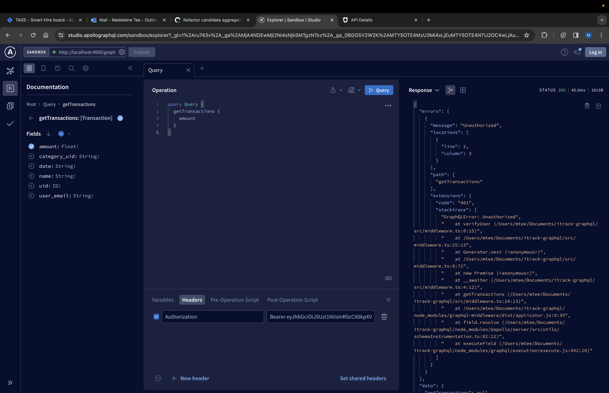

It's been awhile, but I had very good excuse: work and more work. The holidays season has been STRESSFUL to say the least.

Anyway, I got to work adding more more queries and mutations, but before long, it started looking like this:

```
// src/Resolvers.ts
const Resolvers: Resolvers = {
    Query: {
        ...
        getTransactions: async (
            _parent: unknown,
            _args: unknown,
            { user }: ApolloContext
        ) => {
            if (!user.email) {
                throw new GraphQLError('Unauthorized', {
                    extensions: {
                        code: '401'
                    }
                })
            }

            // fetch and return data
        }
    },
    Mutation: {
        ...
        addTransaction: async (
            _: unknown,
            { transaction }: MutationAddTransactionArgs,
            { user }: ApolloContext
        ) => {
            if (!user.email) {
                throw new GraphQLError('Unauthorized', {
                    extensions: {
                        code: '401'
                    }
                })
            }

            // update and return data
        }
    }
}
```

As you can see, `getTransactions` and `addTransaction` both have almost the same implementation - they both check if the user email exists in the context, and if not, they throw an error.

_Why_ I'm checking the email is besides the point. The problem here is as I keep adding more resolvers that needs this checking, this bit of code becomes repetitive, so the best solution is to create a single middleware that can be used by multiple resolvers.

I came across [this question](https://stackoverflow.com/questions/69600434/how-to-set-a-middleware-only-for-a-specific-resolver-in-graphql-backend-using-ap) on StackOverflow and tried out the suggestion.

First, I installed the necessary packages via `npm install @graphql-tools/schema graphql-middleware`.

Then I created the middleware file, applying the auth middleware only for the resolvers I need, `getTransactions` and `addTransaction`:

```
// src/middleware.ts
import { GraphQLError, GraphQLResolveInfo } from 'graphql'

import { ApolloContext } from './types.d'
import { ResolverFn } from './generated/graphql'

const authResolver = async (
    resolve: ResolverFn<object, object, ApolloContext, object>,
    parent: object,
    args: object,
    context: ApolloContext,
    info: GraphQLResolveInfo
) => {
    if (!context.user.email) {
        throw new GraphQLError('Unauthorized', {
            extensions: {
                code: '401'
            }
        })
    }

    return resolve(parent, args, context, info)
}

const Middlewares = {
    Query: {
        getTransactions: authResolver
    },
    Mutation: {
        addTransaction: authResolver
    }
}

export default Middlewares
```

Lastly, I updated the `ApolloServer` initialization:

```
// src/index.ts
import Resolvers from './Resolvers'
import Middlewares from './middleware'

const typeDefs = readFileSync('src/Schema.graphql', { encoding: 'utf-8' })
const schema = makeExecutableSchema({ typeDefs, resolvers: Resolvers })
const schemaWithMiddleware = applyMiddleware(schema, Middlewares)
const server = new ApolloServer<ApolloContext>({
    schema: schemaWithMiddleware,
})
```

Now I can update my `Resolvers` file to remove the parts where I'm throwing a 401 error.

This is the result when testing it:



As usual, you can find the full functioning code [here](https://github.com/fattynomnom/itrack-expressjs).

# Final thoughts

This implementation isn't as intuitive as I'd like it to be. What if a resolver needs multiple middlewares? I can foresee my middleware file easily becoming very complex very quickly, as opposed to in ExpressJS, where you can easily chain middlewares together using `app.use()`.

But maybe I'm being pessimistic and there is a clean, intuitive way to chain middlewares together, I just haven't found it yet. Either way, I'll update this space again with my findings!
