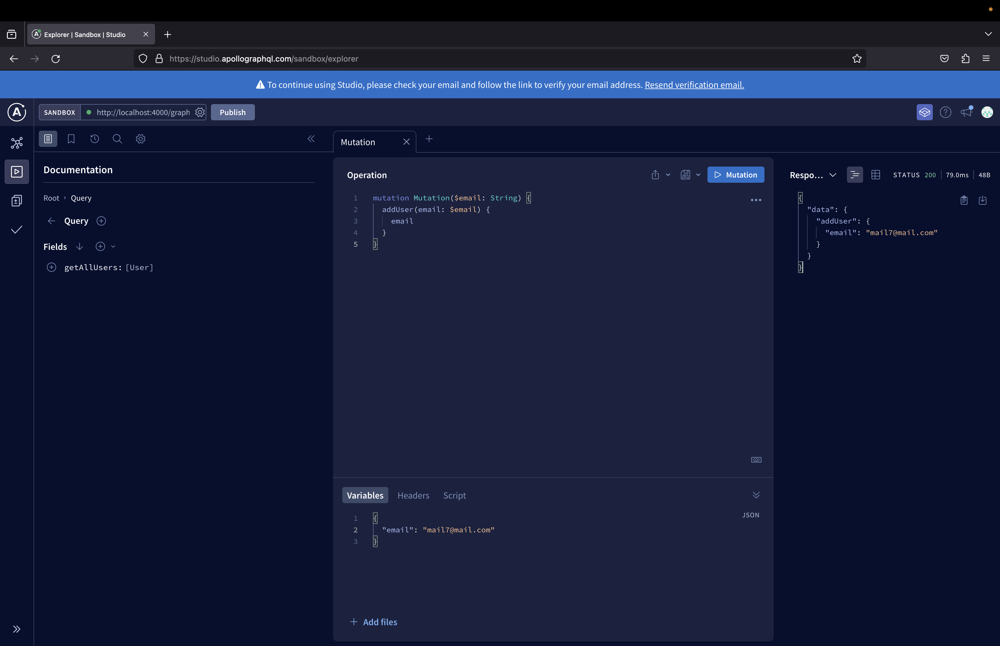

Previously I've already created a front-end NextJs project called [iTrack](https://github.com/fattynomnom/itrack-nextjs).

For context, the purpose of the app is to track user's expenses.

As of right now, the data is the app is mocked, so what I need to do next is create a backend for it, for which I already know I want to use GraphQL (GraphQL > REST ftw).

From past experience, I've used Hasura for creating GraphQL APIs.

**Pros of using Hasura:**

-   Minimal code writing. APIs, models and actions can all be created / managed via UI.
-   Able to connect a PostgreSQL database.
-   Automatically handles hosting of your database and APIs.

**Cons of using Hasura:**

-   Personally prefer writing code than using UI.
-   If I were to host my database and APIs on Hasura, whoever wants to try out my project would also need to host their own database and APIs on Hasura as well, would be easier if APIs and database can run locally.
-   Expanding on allowing users to run project locally, I am aware when using Hasura's UI, our actions (eg. running SQL queries, creating tables) can be "recorded" into code, which can be backed up to another repo to allow replication. However, I find this entire structure very messy, managing our own migration files and code is easier. I could be wrong about this and just don't know how to manage this well enough.

Overall, I decided to forgo using a platform like Hasura. Plus could be a chance to test out my rusty SQL query skills.

First, I setup my ExpressJs app with Apollo so that I can start writing GraphQL APIs. I followed [this tutorial](https://blog.logrocket.com/build-graphql-app-node-js-typescript-graphql-request/).

Then I setup a PostgreSQL database using [these guidelines](https://gist.github.com/phortuin/2fe698b6c741fd84357cec84219c6667).

After the database setup, I followed [this tutorial](https://medium.com/@yasirahboyce/node-express-knex-postgresql-22e10daf0817) to setup Knex.

If you don't know what Knex is, essentially it is query builder for many SQL databases, including PostgreSQL. Tbh, very reminiscent of Laravel days. [Here is the Knex documentation](https://knexjs.org/) if you're curious.

After setting up Knex, I replaced the static datasets with PostgreSQL queries, run `npm run dev` and tested my APIs on [Apollo's GraphQL sandbox](https://studio.apollographql.com/sandbox/explorer):

So far everything works!

I've commited my progress to this repo: [itrack-expressjs](https://github.com/fattynomnom/itrack-expressjs).

**Next steps:**

-   Learn how to use Knex's query builder and replace PostgreSQL queries with Knex
-   Learn how to integrate [Auth0](https://auth0.com/) into our backend application

**Here's a full list of resources I've referenced:**

-   [Knex](https://knexjs.org/)
-   [Build a GraphQL app in Node.js with TypeScript and graphql-request](https://blog.logrocket.com/build-graphql-app-node-js-typescript-graphql-request/)
-   [Set up postgres + database on MacOS (M1)](https://gist.github.com/phortuin/2fe698b6c741fd84357cec84219c6667)
-   [Node + Express + Knex + PostgreSQL](https://medium.com/@yasirahboyce/node-express-knex-postgresql-22e10daf0817)
